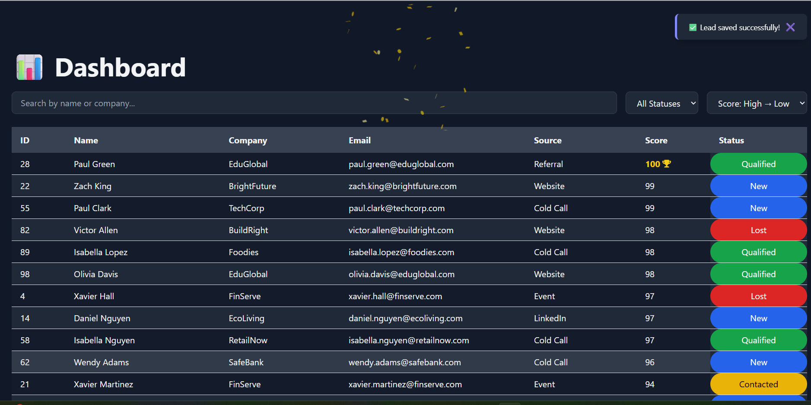

# 📊 Mini Seller Console

A sleek **React + Vite** dashboard for managing leads and opportunities with interactive features, **dark mode 🌑/🌞**, filters, sorting, **confetti 🎉 celebration**, and toast notifications 🔔.

![Dark Mode Dashboard]


---

## 🚀 Features

🌑 **Dark & Light Mode Toggle** – switch themes anytime  
🔍 **Search Leads** by Name or Company  
📊 **Filter by Status**: New 🆕, Contacted 📞, Qualified ✅, Lost ❌ 
🔼🔽 **Sort by Score** (ascending / descending)  
💼 **Opportunities Management** – convert unique leads to opportunities  
🎉 **Confetti Animation** when a new opportunity is created  
✅ **Toast Notifications** for saving and conversion actions (success & error)  
🖱️ **Slide-over Panel** to edit lead details  
⚡ **Responsive & Animated UI** using Framer Motion  
🛠️ **Easy to Install & Run**

---

## 🛠️ Installation

```bash
# Clone the repository
git clone https://github.com/your-username/mini-seller-console.git
cd mini-seller-console

# Install dependencies
npm install
⚡ Running the Project

# Start the development server
npm run dev
Open http://localhost:5173 (or the Vite URL) in your browser.

📝 Usage
View Leads – All leads are displayed in the main dashboard

Search & Filter – Use the search box and dropdowns to filter leads

Edit Lead – Click on a lead to open the slide-over panel. Save changes with Save

Convert to Opportunity – In the slide-over panel, click Convert

✅ Shows toast: "New Opportunity Created!"

🎉 Confetti animation triggered

⚠️ If lead already exists as an opportunity: "This lead is already an opportunity!"

Save Lead Changes – Toast appears: "Lead saved successfully!"

🧩 Components
Dashboard.jsx – Main dashboard page with leads & opportunities tables

LeadDetailPanel.jsx – Slide-over panel for lead details editing & conversion

Toast.jsx – Toast notification component for success & error messages

🎨 UI & Animations
Framer Motion for smooth animations of rows & panels

Canvas Confetti for celebratory effects 🎊

TailwindCSS for responsive styling and dark mode support

🔧 Context & State Management
React Context (AppContext) manages:

leads & opportunities

selectedLead

filters & search

notifications & darkMode

📂 Project Structure

mini-seller-console/
│
├─ src/
│  ├─ assets/
│  │  └─ darkmode_dash.png
│  ├─ components/
│  │  ├─ LeadDetailPanel.jsx
│  │  └─ Toast.jsx
│  ├─ pages/
│  │  └─ Dashboard.jsx
│  ├─ AppContext.jsx
│  └─ main.jsx
│
├─ package.json
├─ vite.config.js
└─ README.md

💡 Future Improvements
🔐 User authentication & role-based access
📈 Export data to PDF / CSV
📱 Enhanced responsive design for mobile & tablet
✅ Unit and integration tests

🖤 Credits
Made with ❤️ by Mariana Aguiar – FrontEnd Developer using React, Vite, TailwindCSS, Framer Motion, and canvas-confetti. 🎨🚀